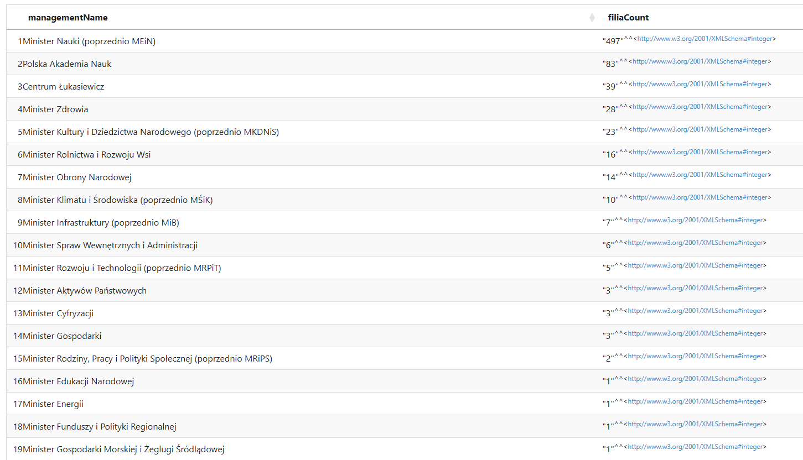
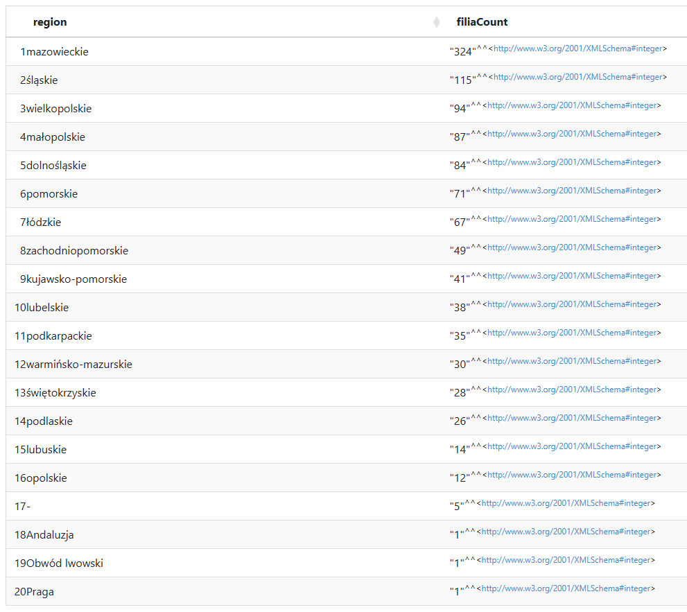
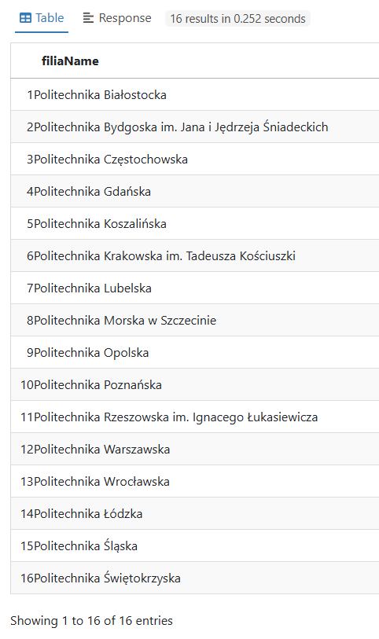

## Example Queries

In this files directory, there are currently 3 different example queries made on the branches_institutions.ttl file.
The queries were developed using apache jena fuseki (instructions to download: https://jena.apache.org/documentation/fuseki2/#download-fuseki-with-ui), but one can also use some online SPARQL engines (for example: https://atomgraph.github.io/SPARQL-Playground/).
Each one of them has a screenshot and a short overview in this section below:

### Management

It is a simple group by query, that shows how many of different branches of universities reports to what entity.

### Region

Similar to previous query, that shows how many of different branches of universities there are per voivodeship.

### Universities Of Technology

A query that shows all the Universities of Technology. (Entities that name begins with "Politechnika")

